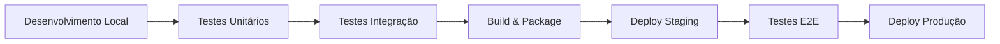

# VeloFlux - Guia de Desenvolvimento e Arquitetura

## Visão Geral do Projeto

O VeloFlux é um sistema de load balancer inteligente multi-tenant com recursos avançados de IA, monitoramento, autenticação OIDC, billing e gerenciamento de usuários. Este documento detalha a arquitetura completa e como desenvolver no projeto.

## Arquitetura Geral

```
┌─────────────────────────────────────────────────────────────┐
│                        Frontend                              │
│  React + TypeScript + Dashboard + Componentes              │
└─────────────────────┬───────────────────────────────────────┘
                      │ HTTP/HTTPS + JWT
┌─────────────────────▼───────────────────────────────────────┐
│                     Backend API                             │
│  Go + Gin + JWT + Redis + Multi-tenant                     │
└─────────────────────┬───────────────────────────────────────┘
                      │
┌─────────────────────▼───────────────────────────────────────┐
│                      Redis                                  │
│  Cache + Session + Data Storage                            │
└─────────────────────────────────────────────────────────────┘
```

### Componentes Principais

1. **Frontend (React/TypeScript)**
   - Interface de usuário moderna e responsiva
   - Dashboard com métricas em tempo real
   - Componentes para gerenciamento (Users, OIDC, Monitoring)
   - Hooks customizados para integração com APIs

2. **Backend (Go)**
   - APIs RESTful seguras
   - Autenticação JWT
   - Multi-tenancy
   - Load balancing inteligente
   - Métricas Prometheus

3. **Redis**
   - Cache de alta performance
   - Armazenamento de sessões
   - Dados temporários
   - Configurações de tenant

4. **Monitoramento**
   - Prometheus metrics
   - Logs estruturados
   - Alertas automáticos
   - Dashboard de métricas

## Estrutura de Diretórios

```
VeloFlux/
├── backend/                    # Backend Go
│   ├── cmd/                    # Aplicações
│   │   └── velofluxlb/        # Executável principal
│   ├── internal/              # Código interno
│   │   ├── api/               # Handlers de API
│   │   ├── auth/              # Autenticação JWT
│   │   ├── config/            # Configurações
│   │   ├── middleware/        # Middlewares HTTP
│   │   ├── server/            # Servidor HTTP
│   │   └── tenant/            # Lógica multi-tenant
│   ├── go.mod                 # Dependências Go
│   └── Dockerfile             # Container backend
├── frontend/                  # Frontend React
│   ├── public/               # Arquivos estáticos
│   ├── src/                  # Código fonte
│   │   ├── components/       # Componentes React
│   │   │   └── dashboard/    # Componentes do dashboard
│   │   ├── hooks/            # Hooks customizados
│   │   ├── services/         # Serviços API
│   │   ├── types/            # Tipos TypeScript
│   │   └── utils/            # Utilitários
│   ├── package.json          # Dependências Node
│   └── Dockerfile            # Container frontend
├── infra/                    # Infraestrutura
│   ├── config/               # Configurações
│   ├── docker/               # Docker configs
│   └── kubernetes/           # K8s manifests
├── docs/                     # Documentação
├── scripts/                  # Scripts utilitários
└── docker-compose.yml        # Orquestração local
```

## Fluxo de Desenvolvimento

### 1. Setup do Ambiente

```bash
# Clone do repositório
git clone <repo-url>
cd VeloFlux

# Iniciar com Docker Compose
docker-compose up -d

# Ou desenvolvimento local
# Backend
cd backend
go mod tidy
go run cmd/velofluxlb/main.go

# Frontend
cd frontend
npm install
npm start
```

### 2. Workflow de Desenvolvimento



### 3. Padrões de Código

#### Backend (Go)

```go
// Estrutura de handler
type Handler struct {
    service Service
    logger  *log.Logger
}

func (h *Handler) HandleRequest(c *gin.Context) {
    // 1. Validar input
    var req RequestType
    if err := c.ShouldBindJSON(&req); err != nil {
        c.JSON(400, gin.H{"error": "invalid request"})
        return
    }

    // 2. Processar
    result, err := h.service.Process(req)
    if err != nil {
        h.logger.Error("processing failed", "error", err)
        c.JSON(500, gin.H{"error": "internal error"})
        return
    }

    // 3. Responder
    c.JSON(200, result)
}
```

#### Frontend (React/TypeScript)

```typescript
// Estrutura de componente
interface Props {
  data: DataType;
  onUpdate: (data: DataType) => void;
}

export function Component({ data, onUpdate }: Props) {
  const [loading, setLoading] = useState(false);
  const [error, setError] = useState<string | null>(null);

  const handleAction = useCallback(async () => {
    try {
      setLoading(true);
      setError(null);
      // processar
      onUpdate(newData);
    } catch (err) {
      setError(err.message);
    } finally {
      setLoading(false);
    }
  }, [onUpdate]);

  if (loading) return <LoadingSpinner />;
  if (error) return <ErrorMessage error={error} />;

  return (
    <div>
      {/* JSX */}
    </div>
  );
}
```

## APIs e Integração

### Padrão de Response

Todas as APIs seguem o padrão:

```json
{
  "success": true,
  "data": { /* dados específicos */ },
  "message": "Operação realizada com sucesso",
  "timestamp": "2024-01-01T12:00:00Z"
}
```

### Tratamento de Erros

```json
{
  "success": false,
  "error": {
    "code": "VALIDATION_ERROR",
    "message": "Dados inválidos",
    "details": {
      "field": "email",
      "reason": "formato inválido"
    }
  },
  "timestamp": "2024-01-01T12:00:00Z"
}
```

### Autenticação

1. **Login**: POST `/api/auth/login` → JWT token
2. **Headers**: `Authorization: Bearer <token>`
3. **Tenant**: `X-Tenant-ID: <tenant_id>`
4. **Refresh**: Automático via interceptors

## Configuração Multi-Tenant

### Backend Configuration

```yaml
# backend-config.yaml
server:
  api_port: 8080
  metrics_port: 2112

redis:
  url: "redis://localhost:6379"
  password: ""
  db: 0

jwt:
  secret: "sua-chave-super-secreta"
  expiration: "24h"

tenants:
  default: "tenant1"
  isolation: true

cors:
  origins:
    - "http://localhost:3000"
    - "https://app.veloflux.io"
```

### Tenant Isolation

```go
// Cada tenant tem seu namespace no Redis
func (t *TenantService) GetKey(tenantID, key string) string {
    return fmt.Sprintf("tenant:%s:%s", tenantID, key)
}

// Middleware de tenant
func TenantMiddleware() gin.HandlerFunc {
    return func(c *gin.Context) {
        tenantID := c.GetHeader("X-Tenant-ID")
        if tenantID == "" {
            c.JSON(400, gin.H{"error": "tenant ID required"})
            c.Abort()
            return
        }
        c.Set("tenant_id", tenantID)
        c.Next()
    }
}
```

## Segurança

### 1. Autenticação JWT

```go
type Claims struct {
    UserID   string `json:"sub"`
    Username string `json:"username"`
    TenantID string `json:"tenant_id"`
    jwt.StandardClaims
}

func GenerateToken(user User, tenantID string) (string, error) {
    claims := Claims{
        UserID:   user.ID,
        Username: user.Username,
        TenantID: tenantID,
        StandardClaims: jwt.StandardClaims{
            ExpiresAt: time.Now().Add(24 * time.Hour).Unix(),
            IssuedAt:  time.Now().Unix(),
        },
    }
    
    token := jwt.NewWithClaims(jwt.SigningMethodHS256, claims)
    return token.SignedString([]byte(jwtSecret))
}
```

### 2. Validação de Input

```go
func ValidateCreateUser(req CreateUserRequest) error {
    if len(req.Username) < 3 {
        return errors.New("username must be at least 3 characters")
    }
    if !isValidEmail(req.Email) {
        return errors.New("invalid email format")
    }
    if len(req.Password) < 6 {
        return errors.New("password must be at least 6 characters")
    }
    return nil
}
```

### 3. Rate Limiting

```go
func RateLimitMiddleware(rpm int) gin.HandlerFunc {
    limiter := rate.NewLimiter(rate.Limit(rpm/60), rpm)
    
    return func(c *gin.Context) {
        if !limiter.Allow() {
            c.JSON(429, gin.H{"error": "too many requests"})
            c.Abort()
            return
        }
        c.Next()
    }
}
```

## Monitoramento e Observabilidade

### 1. Métricas Prometheus

```go
var (
    requestsTotal = prometheus.NewCounterVec(
        prometheus.CounterOpts{
            Name: "http_requests_total",
            Help: "Total number of HTTP requests.",
        },
        []string{"method", "path", "status"},
    )
    
    requestDuration = prometheus.NewHistogramVec(
        prometheus.HistogramOpts{
            Name: "http_request_duration_seconds",
            Help: "HTTP request duration in seconds.",
        },
        []string{"method", "path"},
    )
)

func MetricsMiddleware() gin.HandlerFunc {
    return func(c *gin.Context) {
        start := time.Now()
        
        c.Next()
        
        duration := time.Since(start).Seconds()
        status := strconv.Itoa(c.Writer.Status())
        
        requestsTotal.WithLabelValues(c.Request.Method, c.FullPath(), status).Inc()
        requestDuration.WithLabelValues(c.Request.Method, c.FullPath()).Observe(duration)
    }
}
```

### 2. Logs Estruturados

```go
type LogEntry struct {
    Timestamp string      `json:"timestamp"`
    Level     string      `json:"level"`
    Message   string      `json:"message"`
    Method    string      `json:"method,omitempty"`
    Path      string      `json:"path,omitempty"`
    Status    int         `json:"status,omitempty"`
    Duration  string      `json:"duration,omitempty"`
    TenantID  string      `json:"tenant_id,omitempty"`
    UserID    string      `json:"user_id,omitempty"`
    Error     string      `json:"error,omitempty"`
}

func LogRequest(c *gin.Context, duration time.Duration, err error) {
    entry := LogEntry{
        Timestamp: time.Now().UTC().Format(time.RFC3339),
        Level:     "info",
        Message:   "HTTP request processed",
        Method:    c.Request.Method,
        Path:      c.FullPath(),
        Status:    c.Writer.Status(),
        Duration:  duration.String(),
        TenantID:  c.GetString("tenant_id"),
        UserID:    c.GetString("user_id"),
    }
    
    if err != nil {
        entry.Level = "error"
        entry.Error = err.Error()
    }
    
    log.Printf("%s", toJSON(entry))
}
```

## Testes

### 1. Testes Unitários (Backend)

```go
func TestCreateUser(t *testing.T) {
    // Setup
    service := NewUserService(mockRepo)
    
    // Test
    user := CreateUserRequest{
        Username: "testuser",
        Email:    "test@example.com",
        Password: "password123",
    }
    
    result, err := service.CreateUser(user)
    
    // Assert
    assert.NoError(t, err)
    assert.Equal(t, "testuser", result.Username)
}
```

### 2. Testes de Integração

```go
func TestUserAPIEndpoint(t *testing.T) {
    // Setup test server
    router := setupTestRouter()
    
    // Create request
    req := CreateUserRequest{
        Username: "testuser",
        Email:    "test@example.com",
        Password: "password123",
    }
    
    body, _ := json.Marshal(req)
    
    // Make request
    w := httptest.NewRecorder()
    r := httptest.NewRequest("POST", "/api/tenant/users", bytes.NewBuffer(body))
    r.Header.Set("Content-Type", "application/json")
    r.Header.Set("Authorization", "Bearer "+testToken)
    r.Header.Set("X-Tenant-ID", "test-tenant")
    
    router.ServeHTTP(w, r)
    
    // Assert
    assert.Equal(t, 201, w.Code)
}
```

### 3. Testes Frontend

```typescript
// Component test
test('UserManagement component renders users list', async () => {
  const mockUsers = [
    { id: '1', username: 'user1', email: 'user1@test.com', role: 'user' }
  ];
  
  jest.spyOn(apiClient, 'get').mockResolvedValue({ users: mockUsers, total: 1 });
  
  render(<UserManagement />);
  
  await waitFor(() => {
    expect(screen.getByText('user1')).toBeInTheDocument();
  });
});

// Hook test
test('useUserManagement hook fetches users on mount', async () => {
  const mockUsers = [
    { id: '1', username: 'user1', email: 'user1@test.com', role: 'user' }
  ];
  
  jest.spyOn(apiClient, 'get').mockResolvedValue({ users: mockUsers, total: 1 });
  
  const { result, waitForNextUpdate } = renderHook(() => useUserManagement());
  
  await waitForNextUpdate();
  
  expect(result.current.users).toHaveLength(1);
  expect(result.current.users[0].username).toBe('user1');
});
```

## Deploy e Produção

### 1. Docker

```dockerfile
# Backend Dockerfile
FROM golang:1.21-alpine AS builder
WORKDIR /app
COPY go.mod go.sum ./
RUN go mod download
COPY . .
RUN go build -o velofluxlb cmd/velofluxlb/main.go

FROM alpine:latest
RUN apk --no-cache add ca-certificates
WORKDIR /root/
COPY --from=builder /app/velofluxlb .
EXPOSE 8080 2112
CMD ["./velofluxlb"]
```

### 2. Kubernetes

```yaml
apiVersion: apps/v1
kind: Deployment
metadata:
  name: veloflux-backend
spec:
  replicas: 3
  selector:
    matchLabels:
      app: veloflux-backend
  template:
    metadata:
      labels:
        app: veloflux-backend
    spec:
      containers:
      - name: backend
        image: veloflux/backend:latest
        ports:
        - containerPort: 8080
        - containerPort: 2112
        env:
        - name: REDIS_URL
          value: "redis://redis-service:6379"
        - name: JWT_SECRET
          valueFrom:
            secretKeyRef:
              name: veloflux-secrets
              key: jwt-secret
---
apiVersion: v1
kind: Service
metadata:
  name: veloflux-backend-service
spec:
  selector:
    app: veloflux-backend
  ports:
  - name: api
    port: 8080
    targetPort: 8080
  - name: metrics
    port: 2112
    targetPort: 2112
```

### 3. CI/CD Pipeline

```yaml
# .github/workflows/deploy.yml
name: Deploy
on:
  push:
    branches: [main]

jobs:
  test:
    runs-on: ubuntu-latest
    steps:
    - uses: actions/checkout@v2
    - name: Run tests
      run: |
        cd backend && go test ./...
        cd frontend && npm test

  build:
    needs: test
    runs-on: ubuntu-latest
    steps:
    - uses: actions/checkout@v2
    - name: Build Docker images
      run: |
        docker build -t veloflux/backend ./backend
        docker build -t veloflux/frontend ./frontend
    
  deploy:
    needs: build
    runs-on: ubuntu-latest
    steps:
    - name: Deploy to production
      run: |
        kubectl apply -f infra/kubernetes/
```

## Troubleshooting Comum

### 1. Problemas de Conexão

```bash
# Verificar se serviços estão rodando
curl http://localhost:8080/api/health
curl http://localhost:2112/metrics

# Verificar logs
docker logs veloflux-backend
docker logs veloflux-redis

# Verificar configuração
cat infra/config/backend-config.yaml
```

### 2. Problemas de Autenticação

```bash
# Testar login
curl -X POST http://localhost:8080/api/auth/login \
  -H "Content-Type: application/json" \
  -d '{"username":"admin","password":"senha123"}'

# Verificar token
jwt-cli decode <token>
```

### 3. Problemas de Performance

```bash
# Verificar métricas
curl http://localhost:2112/metrics | grep http_requests

# Verificar Redis
redis-cli info memory
redis-cli slowlog get 10
```

## Roadmap de Desenvolvimento

### Fase 1 (Atual) ✅
- [x] Backend APIs completas
- [x] Frontend dashboard
- [x] Autenticação JWT
- [x] Multi-tenancy
- [x] Monitoramento básico

### Fase 2 (Próxima)
- [ ] Websockets para real-time
- [ ] Rate limiting avançado
- [ ] Cache inteligente
- [ ] Backup automático
- [ ] Audit logs

### Fase 3 (Futuro)
- [ ] Machine Learning para load balancing
- [ ] Auto-scaling
- [ ] Disaster recovery
- [ ] Multi-region
- [ ] GraphQL APIs

## Contribuição

### 1. Padrões de Commit

```
feat: adiciona nova funcionalidade
fix: corrige bug
docs: atualiza documentação
test: adiciona testes
refactor: refatora código
style: ajustes de estilo
```

### 2. Pull Request Template

```markdown
## Descrição
Breve descrição das mudanças

## Tipo de mudança
- [ ] Bug fix
- [ ] Nova funcionalidade
- [ ] Breaking change
- [ ] Documentação

## Testes
- [ ] Testes unitários
- [ ] Testes de integração
- [ ] Testes manuais

## Checklist
- [ ] Código segue padrões do projeto
- [ ] Documentação atualizada
- [ ] Testes passando
```

### 3. Code Review Guidelines

- Verificar funcionalidade
- Validar testes
- Revisar segurança
- Verificar performance
- Validar documentação

Este guia fornece uma visão completa da arquitetura e desenvolvimento do VeloFlux. Para dúvidas específicas, consulte a documentação detalhada ou entre em contato com a equipe de desenvolvimento.
